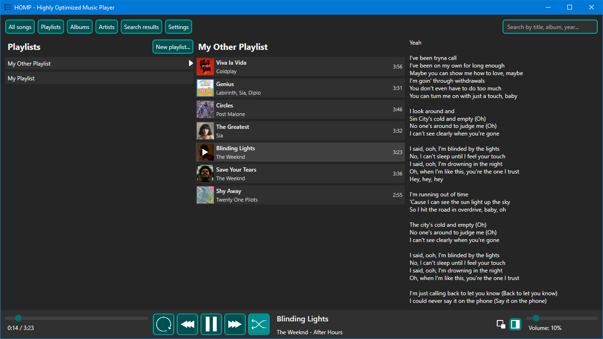

# HOMP - Highly Optimized Music Player  

  

HOMP is a simple lightweight music player.  
Some of its features include:  
- Support for global shortcuts without media keys  
- Lyrics support and built-in lyrics editor  
- Easy to use user interface  
- Automatic album and artist organization
- Ultra fast search for each supported song attribute  

## Global shortcuts  

HOMP was originally created with the goal of creating a music player completely controllable by non-media keys shortcuts that was lightweight enough to be used when doing other heavy tasks.  
The supported shortcuts are:  
- `CTRL-ALT-SHIFT-P`: Play/Pause  
- `CTRL-ALT-SHIFT-N`: Next song in collection  
- `CTRL-ALT-SHIFT-B`: Previous song in collection  
- `CTRL-ALT-SHIFT-R`: Toggle Repeat  
- `CTRL-ALT-SHIFT-S`: Toggle Shuffle  
- `CTRL-ALT-SHIFT-UP`: Volume up by 2% (will be customizable)  
- `CTRL-ALT-SHIFT-DOWN`: Volume down by 2% (will be customizable)  

These shortcuts work even with HOMP running in the background.  
They are currently not customizable, but it is a planned feature that will come in the future.  

## Running HOMP  

HOMP uses WPF and .NET 7.0.  
This makes HOMP a Windows only program and there are no plans to port it to other platforms.  

The project is divided into 2 sub-projects:  
- `CustomMediaPlayerUltimate`: this is the main project, the actual HOMP project  
- `WPFHotkeys`: this is a legacy auxiliary project, which is not needed anymore but is kept for backup reasons.  

The project has a Visual Studio Solution File that you can use to build and edit the project using Visual Studio 2022.  

You can also run `dotnet build` or `dotnet run` in CustomMediaPlayerUltimate/CustomMediaPlayerUltimate.